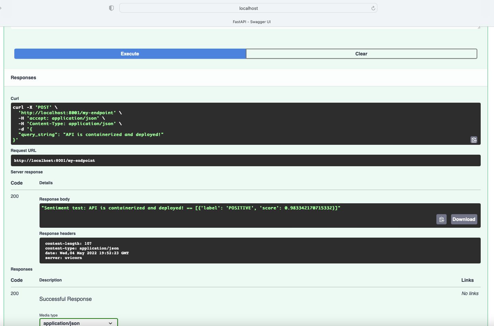

# This repo includes the files to construct and deploy a containerized, local web application capable of analyzing the sentiment of any given sentence.
* Image is created using **Docker**
* Local web app is written using **FastApi**
* Sentiment model is using **HuggingFace DistilBERT** fine-tuned on the Stanford Sentiment Treebank v2 (SST2) task from the GLUE Dataset**

   

# Step by Step: Container Deployment
Deployment of a container is a simple two steps process. I added step 3 to explain how to test the deployed containerized API.

   

# Step 1 - Build the Docker Image
Note: This step may take a few minutes because the Image contains the environment (specified in requirements.txt file) which includes torch.

Build the Docker image of the web application by running:

    $ docker build -t sentiment-analysis .

You can view the image by running

    $ docker images

and see that sentiment-analysis appears as an image.

   

# Step 2 - Run the Image in a Container
Create a container by running:

    docker run -dp 8001:8000 --name sentiment-analysis-container sentiment-analysis

This command exposes port 8001 on the local machine.  If this port is already occupied then change the 8001 port to any available port 

you can view the container by running:

    $ docker ps 

and see that sentiment-analysis-container appears as a container

   

# Step 3 - Testing
    Open your browser and go to localhost:8001/docs 

this will activate swagger and you can use the UI to post a sentence ("try it out" button on the upper right corner)

After pressing the "execute" button you get the sentense sentiment analysis in the server responese box. 

